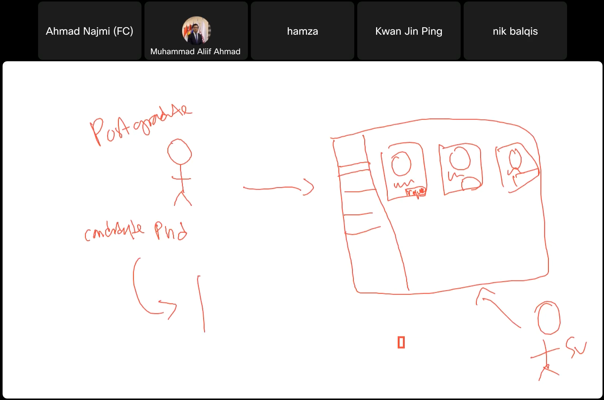
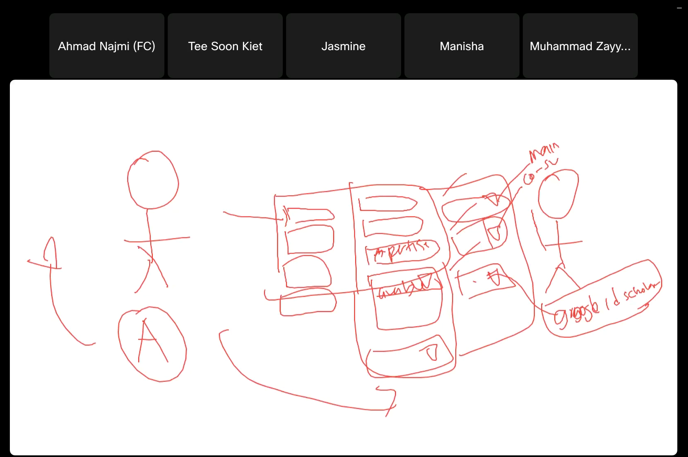
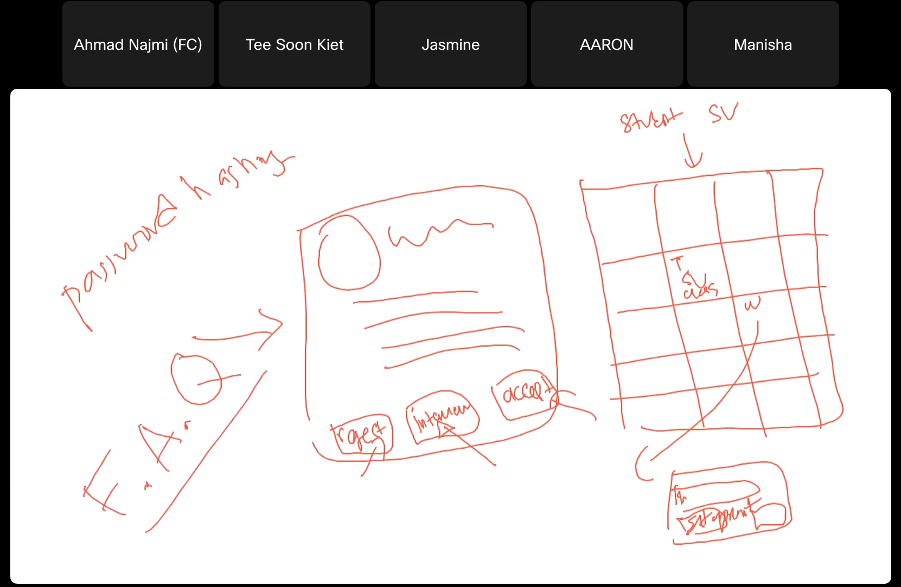

# 4.0 Information Gathering Process

## 4.1 Method Used

To gain more understanding about the existing system and its challenges, we conducted an `interview` with the _**stakeholder**_, who is also a **_senior lecturer of UTM_**, `Dr. Ahmad Najmi`. The interview took place via the `Webex platform` on **_17th of April 2024_**, at **_4.30pm_**, and was attended by our project team as well as other classmates. This method was chosen because interviews allow for in-depth discussions and detailed explanations on the current system’s workflow and user requirements.
  
Dr. Ahmad Najmi, as a user of the current manual system, provided firsthand information about the process and the difficulties faced by both students and supervisors. His input was very important in identifying the challenges faced and expectations for the new system.

## 4.2 Summary of Method Used

The interview consisted of a lot of open-ended questions to obtain detailed information about the current system and the desired features of the new system. Below is a list of the `questions asked` during the interview:
<pre>
1. How do students currently find and contact supervisors manually?
2. Have students expressed difficulties with the current system?
3. What types of documents do students need to upload during their supervision?
4. How can supervisors promote themselves in the new system?
5. Besides a website, is there any other platform for the system?
6. How do you plan to convince supervisors and students to use this new system?
7. Regarding the supervision process, do you have specific requirements for setting deadlines?
8. If students want to request supervision, is there a specific mechanism for this?
9. How do you envision calendar appointments working within the system?
10. Is the system intended for use only by UTM students, or will it be open to others as well?
11. What security measures should be implemented in the system?
12. Does the system allow for interactions between students and supervisors via messaging?
13. If a student is rejected by a supervisor, is there a way to help them improve their chances?
14. Are there any financial, technical, or operational constraints we need to be aware of?
15. Is there a maximum number of postgraduate students that one supervisor can take on?
16. Who will maintain the system once it is developed?
17. Can you foresee any potential problems when implementing this system?
18. What is the estimated cost for the technology needed for the system?
</pre>
Overall, the interview with Dr. Ahmad Najmi highlighted several key issues with the current manual system for postgraduate supervision. Students face difficulties in finding supervisors, often relying on inefficient internet searches and social media. Supervisors also need a way to showcase their expertise and availability. The new system should allow students to upload thesis chapters as PDFs and enable supervisors to set deadlines and track progress. Essential features include an auto-generated request system, integrated calendar for appointments, and secure data management. The platform should be accessible to all Malaysian students and provide feedback on rejected applications to help students improve. Financial constraints require using free software like Laravel, with an estimated development cost of RM40K to RM50K. Dr. Najmi also noted potential resistance from some supervisors who prefer traditional methods. These insights will guide the development of a user-friendly, efficient, and secure online supervision platform.
  
Here are some `screenshots` from the interview with Dr. Ahmad Najmi:

   

Screenshot 1: Discussion on Current Manual System Challenges

Screenshot 2: Explanation of Document Upload Requirements

Screenshot 3: Feedback and Request Mechanism Discussion & Linked Schedule

