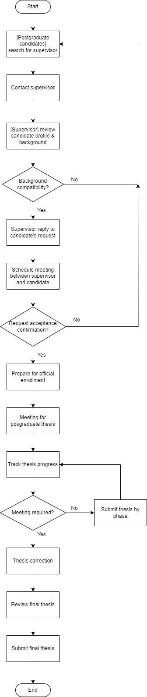

# 4.0 Current Business Process/Workflow
The current business process for finding a supervisor involves several steps that are both time-consuming and inefficient. The `scenarios and workflow` of the current manual system: 
<pre>
Postgraduate candidates search for supervisors through university directories or referrals. 
1. Once they identify potential supervisors, they contact them via email or in-person visits. 
2. Supervisors then review the postgraduate candidates’ profiles and decide on meetings. 
3. Supervisor will provide a reply to the candidate's request on whether to accept or reject the supervision request.
4. Candidates schedule a meeting with the supervisor for a deeper conversation and discussion on the future work.
5. After accepting the enrollment offer, the student will schedule a meeting with the supervisor to discuss the postgraduate thesis.
6. Supervisor starts tracking postgraduate thesis progress, and schedules meetings with students if required.
7. Students submit the thesis phase by phase and are reviewed by the supervisor.
8. Students submit the final reviewed thesis.
</pre>
The process above involves extensive back-and-forth communications, making it cumbersome and time-consuming for both students and supervisors.

