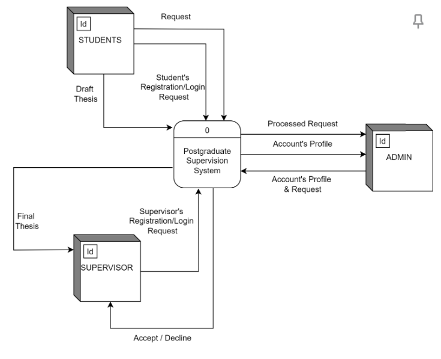
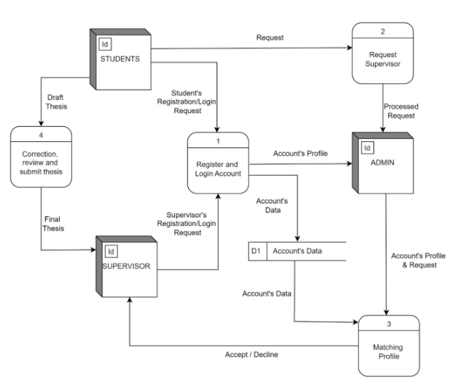
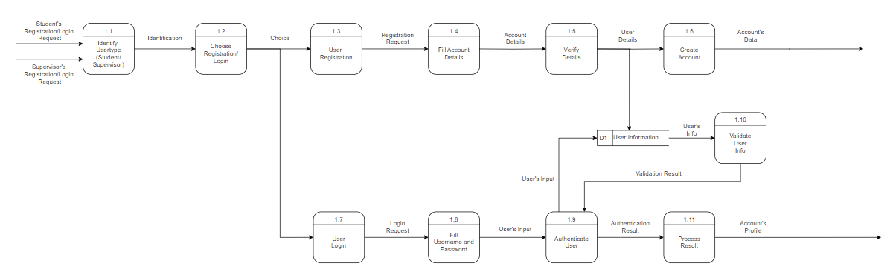
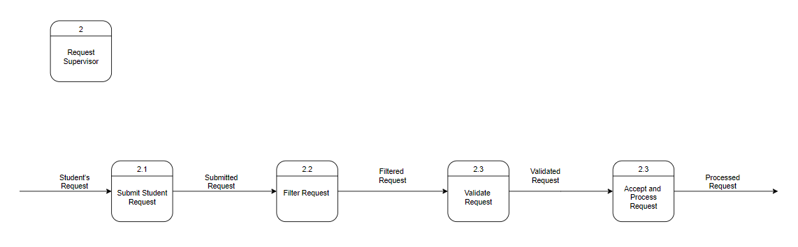
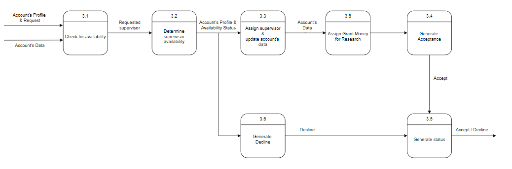
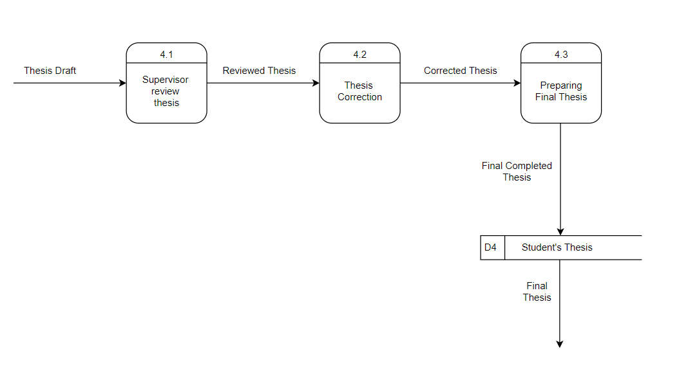
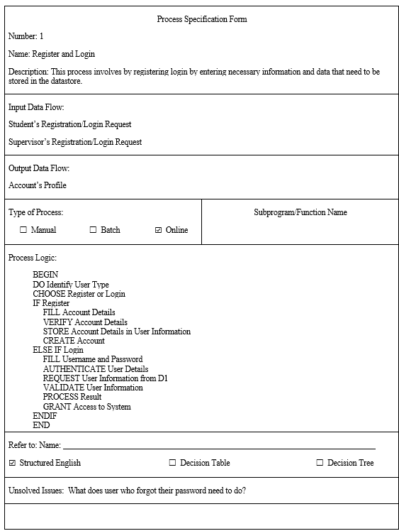
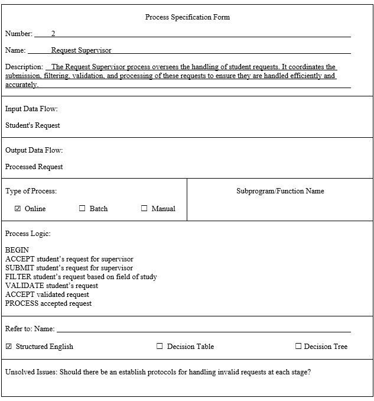
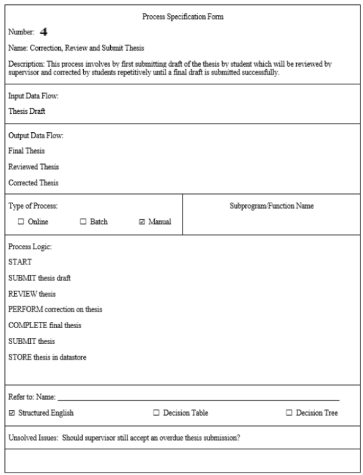

# 6.0 System Analysis and Specification
## 6.1 Logical DFD TO-BE system
### Context Diagram

### Diagram 0

### Child Diagram : Process 1

### Child Diagram : Process 2

### Child Diagram : Process 3

### Child Diagram : Process 4

## 6.2 Process Specification
### PROCESS 1: REGISTER AND LOGIN (STRUCTURED ENGLISH)

### PROCESS 2: REQUEST SUPERVISOR

### PROCESS 3: MATCHING PROFILE (DECISION TREE)

### PROCESS 4: THESIS SUBMISSION (STRUCTURED ENGLISH)

