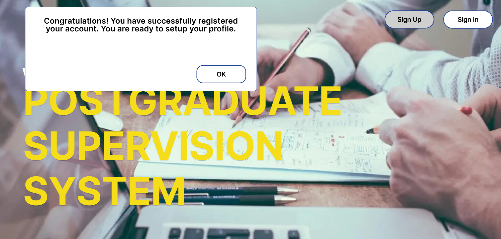
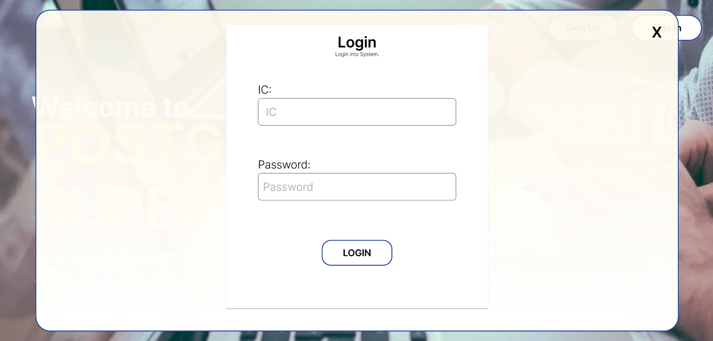

## Main Page

## Sign Up Page (Account Registration)
Users are required to fill in the informations: Full Name, IC, email and password.
As every Malaysian has an unique IC number, this will also used as an unique identifier in a system.
Then, users are required to choose their respoective usertype (Student/Supervisor)

## Pop-Up Message: Registration Successful

## Profile Setup
Users are able to set up their profile by inputting various information to promote themselves.
For instance, 
Students can fill in their academic achievements, intern/working experience etc.
Supervisor can fill in their publications, field of study etc.

## Login Page
Users are able to login to their account after account registration.
IC and password input is to authenticate the user's account.

## [Student] Main Menu
Students are able to request for supervisor, schedule an appointment with supervisor through calendar and submit thesis for review.

## [Student] Filter Supervisor by Field of Study
Students are able to search for supervisor in this page. There is a filtration system that filters the supervisor according to the field of study, This simplifies the searching process.

